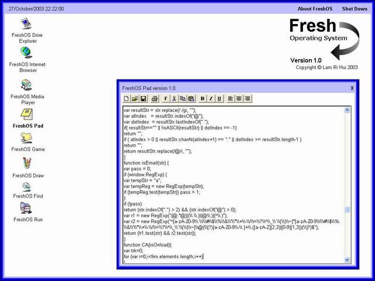



## FreshOS

### Description

FreshOS comes with a bunch of tools and software. You can do almost everything using this program such as exploring your drive's content, surfing the internet, playing music and videos, editing your documents, perform a painting, finding a file, running a file and playing games. Your comments are welcomed. Feel free to vote.
 
### More Info
 

             |
---                |---
**Submitted On**   |2003-10-28 09:16:40
**By**             |[Lam Ri Hui](https://github.com/Planet-Source-Code/PSCIndex/blob/master/ByAuthor/lam-ri-hui.md)
**Level**          |Intermediate
**User Rating**    |4.8 (91 globes from 19 users)
**Compatibility**  |VB 4\.0 \(16\-bit\), VB 4\.0 \(32\-bit\), VB 5\.0, VB 6\.0
**Category**       |[Complete Applications](https://github.com/Planet-Source-Code/PSCIndex/blob/master/ByCategory/complete-applications__1-27.md)
**World**          |[Visual Basic](https://github.com/Planet-Source-Code/PSCIndex/blob/master/ByWorld/visual-basic.md)
**Archive File**   |[FreshOS\_\-\_1665581112003\.zip](https://github.com/Planet-Source-Code/lam-ri-hui-freshos__1-49569/archive/master.zip)

